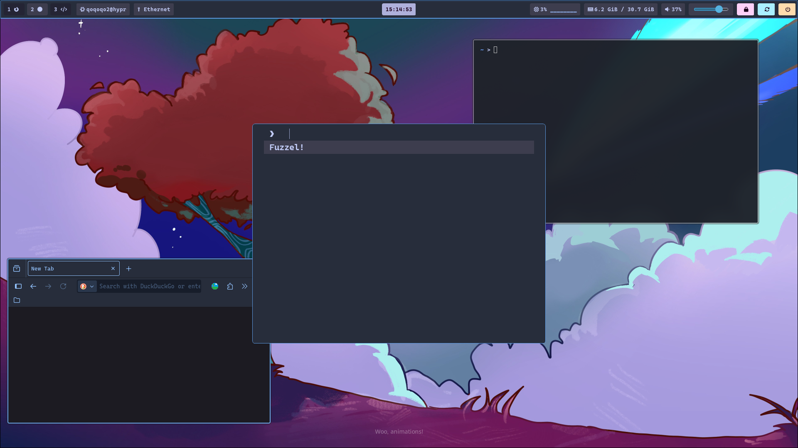
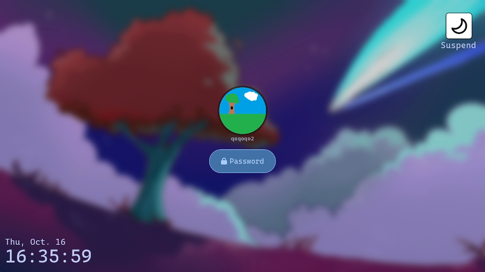

# Dotfiles

Really messy hyprland config

## Stuff I use
Window Manager - Hyprland
Terminal Emulator - Kitty
Shell - Zsh ( There is also a Bash config )
Launcher - Fuzzel

## Screenshots

## Credits
[Kitty Config Credits](https://github.com/IhTiYaR0/Hyprland-Config/tree/main)

[Additional Credits](https://github.com/Mon4sm/monasm-dots/tree/main)

## Other
[Firefox Theme](https://addons.mozilla.org/en-US/firefox/addon/qoqoqo2-theme/)
